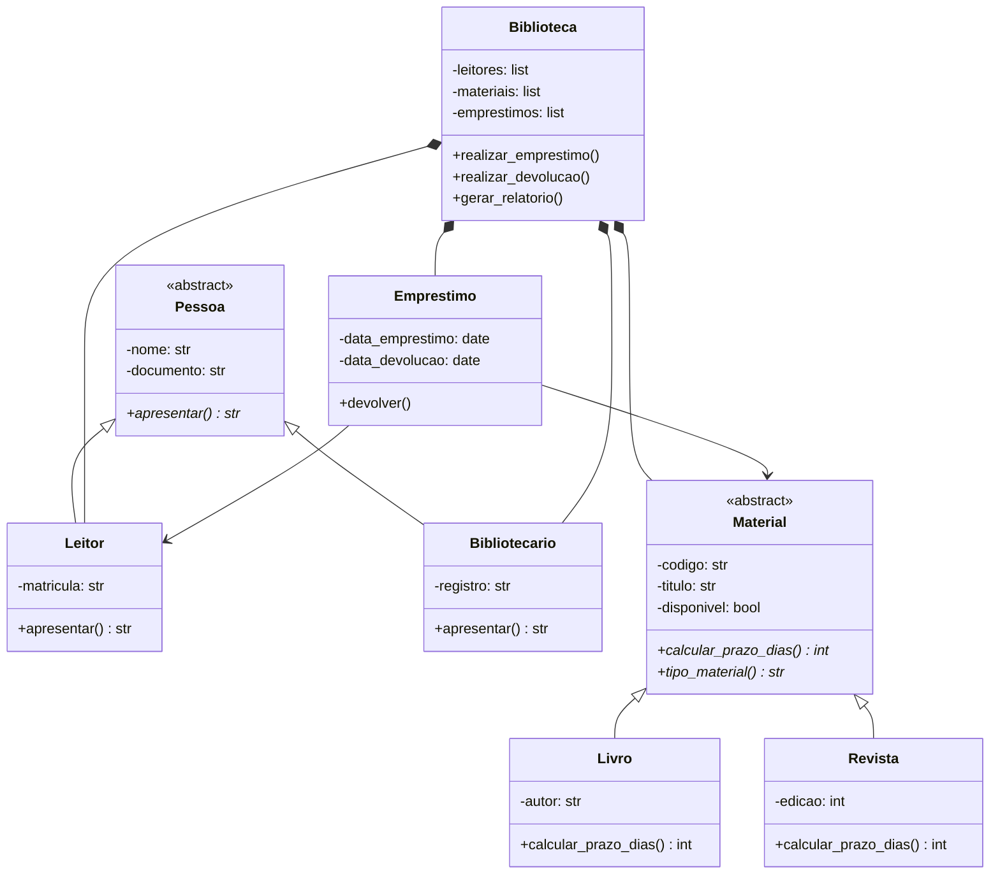

```mermaid
classDiagram

    class Pessoa {
        <<abstract>>
        -nome: str
        -documento: str
        +apresentar()* str
    }

    class Leitor {
        -matricula: str
        +apresentar() str
    }

    class Bibliotecario {
        -registro: str
        +apresentar() str
    }

    class Material {
        <<abstract>>
        -codigo: str
        -titulo: str
        -disponivel: bool
        +calcular_prazo_dias()* int
        +tipo_material()* str
    }

    class Livro {
        -autor: str
        +calcular_prazo_dias() int
    }

    class Revista {
        -edicao: int
        +calcular_prazo_dias() int
    }

    class Emprestimo {
        -data_emprestimo: date
        -data_devolucao: date
        +devolver()
    }

    class Biblioteca {
        -leitores: list
        -materiais: list
        -emprestimos: list
        +realizar_emprestimo()
        +realizar_devolucao()
        +gerar_relatorio()
    }

    Pessoa <|-- Leitor
    Pessoa <|-- Bibliotecario

    Material <|-- Livro
    Material <|-- Revista

    Biblioteca *-- Leitor
    Biblioteca *-- Bibliotecario
    Biblioteca *-- Material
    Biblioteca *-- Emprestimo

    Emprestimo --> Leitor
    Emprestimo --> Material
```